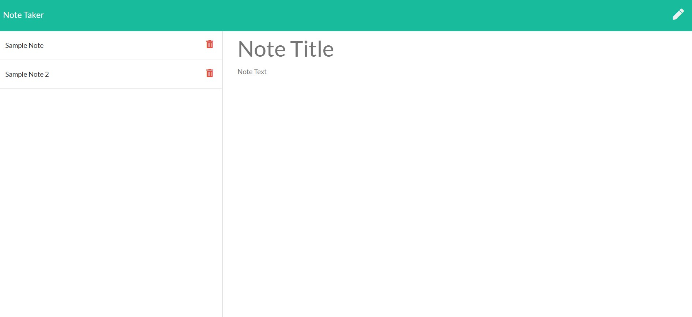

# Note Taker

## Description and Purpose
A web application that can be used to write and save notes. Application uses Express.js back end functionality and saves and retrieves note data from a JSON file.

Each note is created with a title, body text, and a unique id. Ids are randomly generated using uuid, available through NPM.

## Table of Contents
  - [Description and Purpose](#description-and-purpose)
  - [Application Screenshot](#application-screenshot)
  - [Deployed Application](#deployed-application)
  - [Built With](#built-with)
  - [Usage](#usage)
  - [License](#license)
  - [Contributing](#contributing)
  - [Tests](#tests)
  - [Questions](#questions)

## Application Screenshot

## Deployed Application
https://thawing-earth-43443.herokuapp.com/

## Built With
* JavaScript
* Node.js
* Express.js
* HTML
* Bootstrap
* CSS
* uuid

## Usage
Enter note information by proiding a note title, note text, and selecting the save button in the upper right-hand corner.

## License
MIT License

## Contributing
Developed by Mike Shelby

## Questions
Github Username: mikegshelby

Github Profile: https://github.com/mikegshelby

Email: mikegshelby@gmail.com

Please email me with any questions about this project!